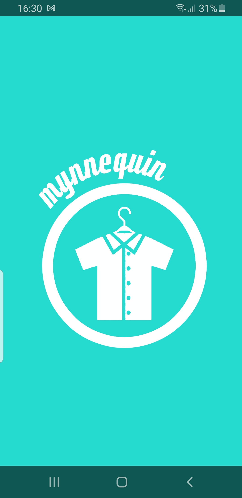
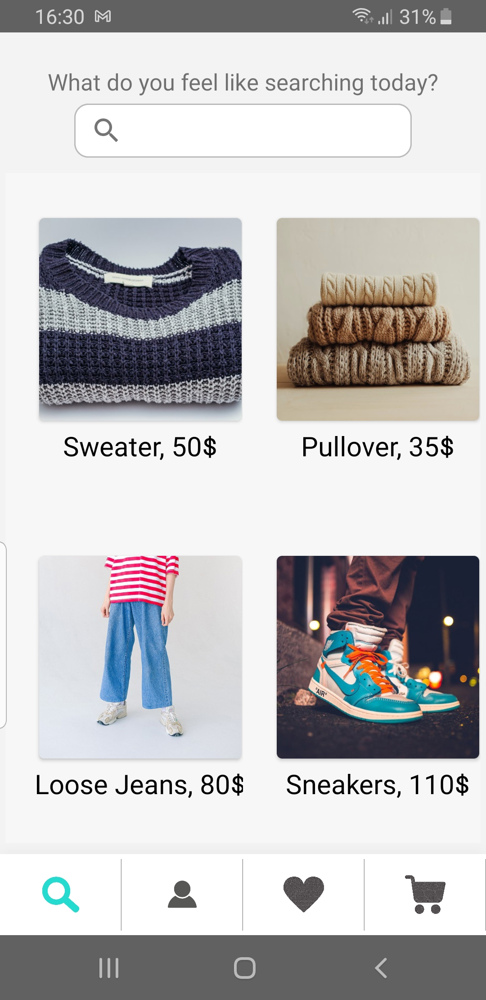
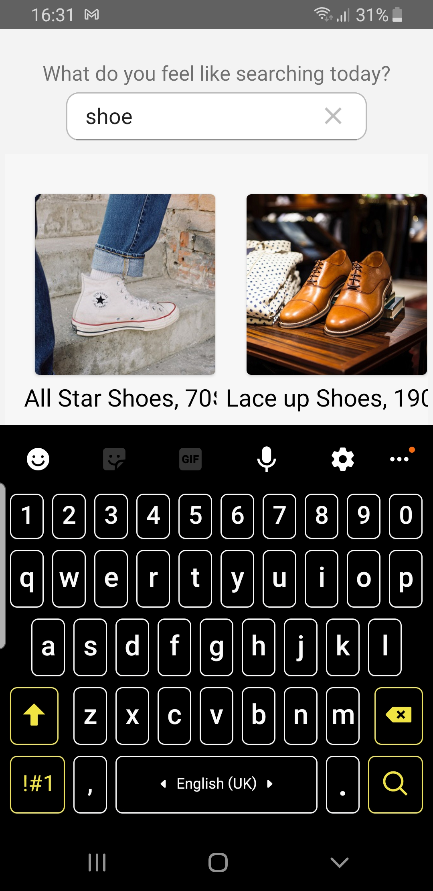
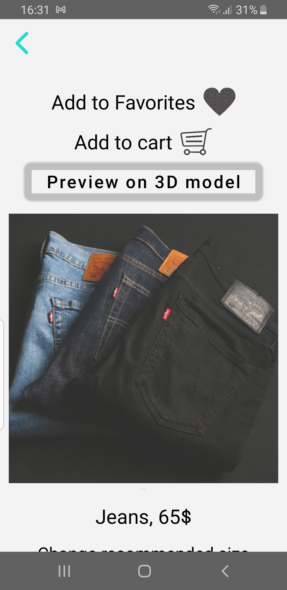
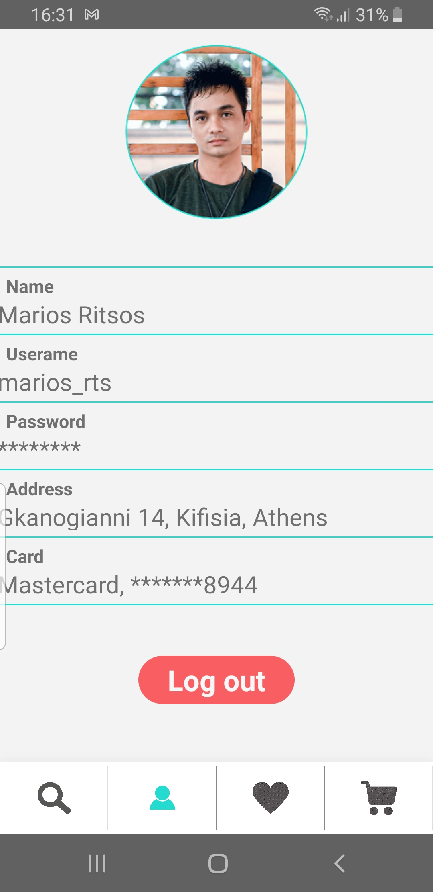
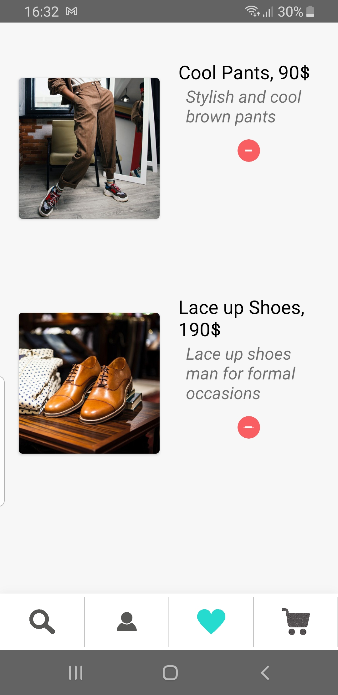
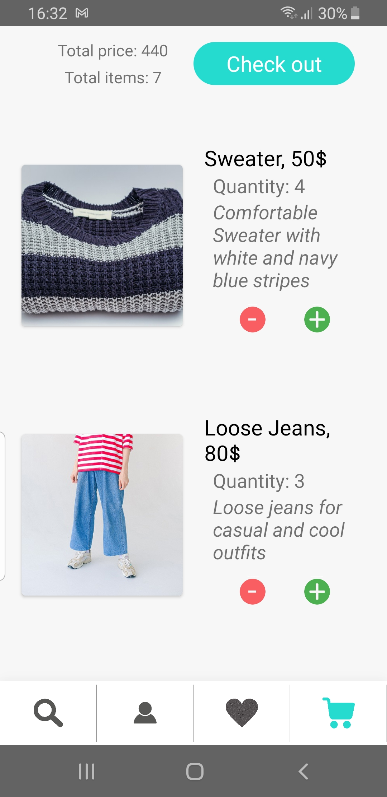

# mynnequin Android App

Mynnequin is an Android app for online clothing shopping. 

It was developed for the purposes of the NTUA ECE [Human-­Computer Interaction Course](https://eclass.ails.ece.ntua.gr/courses/101/).

Some images of this app running on an Android phone:

  
  

  
  

  
  

  

